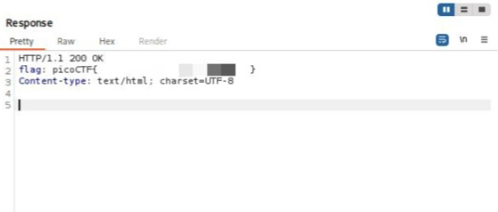

## GET aHEAD - Web Exploitation - Easy
#### Author: madStacks

Dicas:
1. Maybe you have more than 2 choices
2. Check out tools like Burpsuite to modify your requests and look at the responses

Ao navegar pelo site, observa-se que as requisições HTTP eram feitas com os métodos `GET` e `POST`. Usando o BurpSuite como proxy, **Proxy > Intercept**, é possível a requisição HTTP que estava sendo enviada para o servidor:
```
GET /index.php? HTTP/1.1
Host: mercury.picoctf.net:15931
```

Como o próprio nome do CTF indica "get a HEAD", indicando outro método além de GET e POST, enviei a interceptação ao repetidor, alterei o método `GET` para `HEAD` e obtive a flag! 

