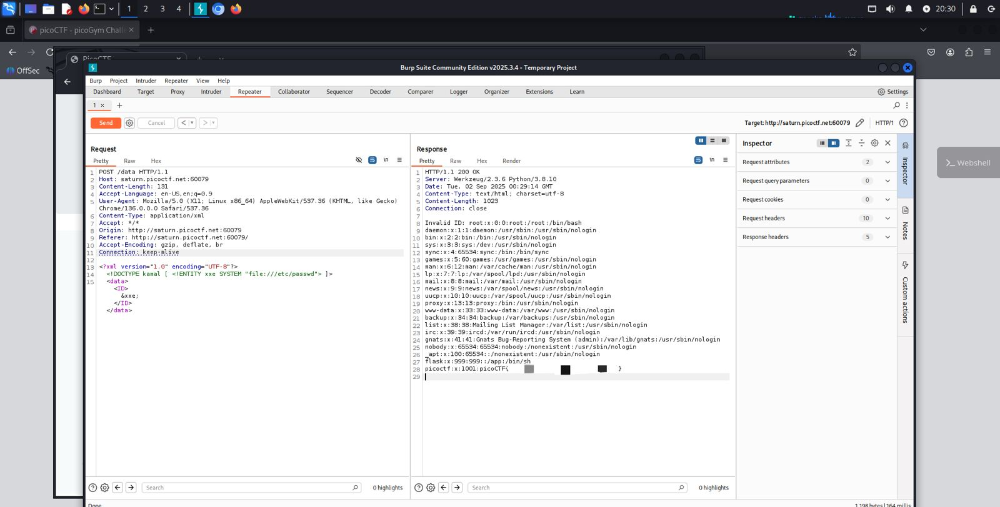

## SOAP - Web Exploitation - Médio
#### Author: Geoffrey Njogu

Dicas:
1.  XML external entity Injection

O nome do desafio ("SOAP") e a dica ("XXE") indicam que a aplicação utiliza XML para comunicação e está vulnerável a um ataque de XML External Entity Injection. A estratégia foi interceptar uma requisição, identificar o corpo em XML e modificá-lo para ler o arquivo `/etc/passwd` no servidor, conforme indicado pela dica. <br>
Utilizando o Burp Suite, interceptei a requisição feita ao clicar no botão "Details". Isso revelou uma requisição POST para o endpoint /data com um corpo em XML. Modifiquei o corpo da requisição para injetar uma DTD (Document Type Definition) maliciosa. Esta DTD define uma entidade (&xxe;) que aponta para o arquivo `file:///etc/passwd` e depois a chama dentro da tag `<ID>`. Payload final:
```
<?xml version="1.0" encoding="UTF-8"?>
<!DOCTYPE kamal [ <!ENTITY xxe SYSTEM "file:///etc/passwd"> ]>
<data><ID>&xxe;</ID></data>
```

Ao enviar a requisição modificada com o Burp Repeater, o servidor respondeu com o conteúdo do arquivo, revelando a flag: 

<p align="center">
  
</p>
