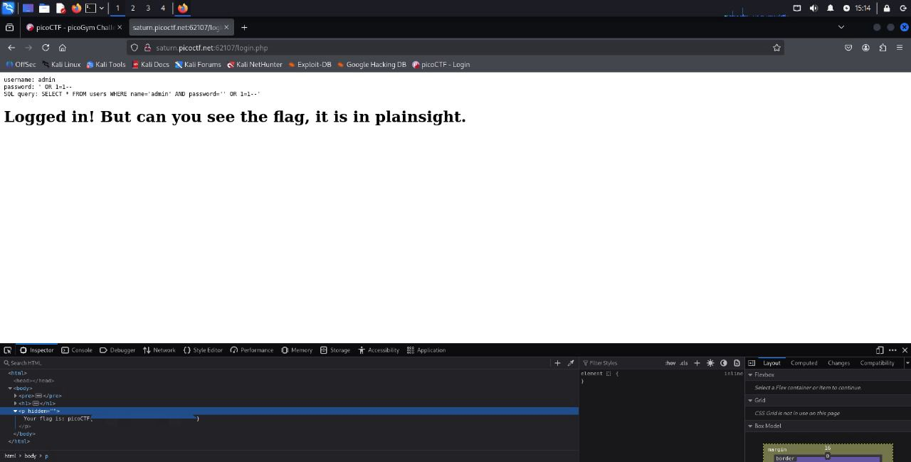

## SQLiLite - Web Exploitation - Medium
#### Author: Mubarak Mikail

Dica: 
1. `admin` is the user you want to login as.

O objetivo era "invadir" um site de login usando SQL Injection para acessar como o usuário "admin", cuja senha era desconhecida. Realizei uma tentativa de acesso usando o user já informado, `admin`, e, para senha, tentei um payload direto com `' OR 1=1--`, e obtive acesso bem sucedido.  
Após o login bem-sucedido, a própria página de destino exibia a consulta SQL exata que foi executada no banco de dados, já com o payload injetado: `SELECT * FROM users WHERE name='admin' AND password=' ' OR 1=1--'`. Essa revelação direta da query após a injeção confirmou o sucesso do ataque e elucidou a exata forma como o banco de dados interpretou o payload.  
Quanto ao payload, uma explicação rápida. A query mostrada na página (SELECT * FROM users WHERE name='admin' AND password=' ' OR 1=1--') confirma que:  
- O caractere ' (apóstrofo) no início do payload fechou a string original da senha.
- A parte OR 1=1 adicionou uma condição que é sempre verdadeira.
-Os caracteres -- (dois hifens) atuaram como comentários em SQL, fazendo com que todo o restante da consulta fosse ignorado pelo banco de dados.

Dessa forma, a lógica de autenticação foi efetivamente alterada para name='admin' E (password='' OR TRUE), resultando em um login bem-sucedido para o usuário admin sem a necessidade de conhecer a senha correta.  
A flag estava em um parágrafo oculto na página, e pôde ser descoberta inspecionando a mesma!

  

