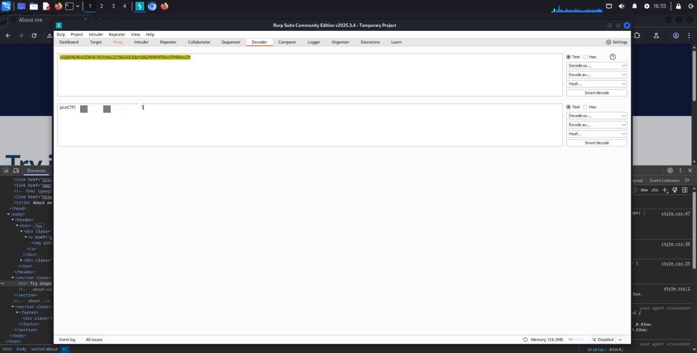

## WebDecode - Web Exploitation - Easy
#### Author: Nana Ama Atombo-Sackey

Dicas: 
1. Use the web inspector on other files included by the web page.
2. The flag may or may not be encoded

Ao inspecionar o `about.html`, uma seção em específico chama a atenção. Nela, o "notify_true" armazena uma sequência de dígitos, anormais em seções de html:
```
<section class="about" notify_true="cGljb0NURnt3ZWJfc3VjYzNzc2Z1bGx5X2QzYzBkZWRfMTBmOTM3NmZ9">
   <h1>
    Try inspecting the page!! You might find it there
   </h1>
   <!-- .about-container -->
  </section>
  <!-- .about -->
```

O próprio BurpSuite possui um "Decoder". Então, ao decodificar por Base64, obtive a flag!

<p align="center">
  
</p>
