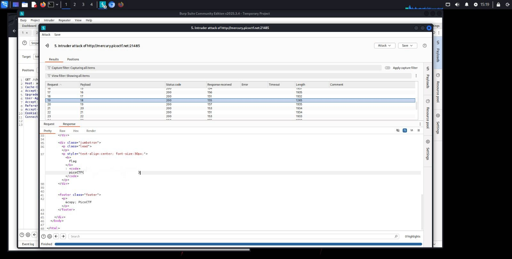

## Cookies - Web Exploitation - Easy
#### Author: madStacks

Dicas: (none)

O desafio pedia para encontrar uma flag explorando a forma como a aplicação lidava com cookies. Ao acessar a página do desafio, observei um campo de texto onde era possível digitar um "nome de cookie" e um botão "Search". Ao digitar o placeholder "`snickerdoodle`", recebi a resposta "That is a cookie! Not very special though...". Em outra tentativa, recebi "That doesn't appear to be a valid cookie.".  
Utilizando o Burp Suite como proxy, interceptei as requisições e notei que a aplicação estava manipulando um cookie HTTP chamado `name`. Mudando o valor desse cookie com o Burp Repeater, é possível perceber que o servidor respondia de forma variada dependendo do valor atribuído a esse cookie. Assim, seria bem possível que a flag também estivesse armazenada em um desses valores. 

Com isso em mente, configurei o BurpSuite para interceptar as requisições. Usei o mesmo placeholder e, após a requisição ser encaminhada (`Forward`), enviei ao **Intruder**. Aqui, criei um payload para automatizar as tentativas de localizar a flag.  
Na requisição `Cookie: name=-1`, em **Intruder > Positions**, selecionei o "-1" para adicionar os payloads. Em **Intruder > Payloads**, defini o tipo como números e configurei o range para testar valores inteiros: `From: 0`, `To: 30`, e `Step: 1`.

Minha principal métrica de identificação da flag foi a coluna **Length**, já que uma variação "anormal" determinaria uma mudança no conteúdo da página. Assim, na requisição com o payload 18, localizei a flag!

