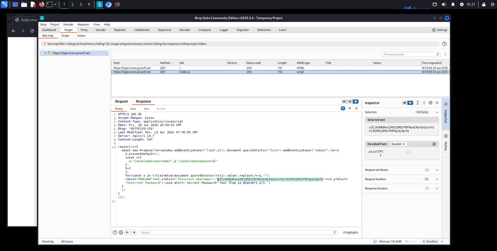

## login - Web Exploitation - Medium
#### Author: BrownieInMotion

Dicas: (none)

Bendito BurpSuite!  
Alternativamente, investigar a página de login levaria à mesma linha codificada, em `Sources`, no JavaScript. Decodificando de Base64, obtém-se a flag.

  

