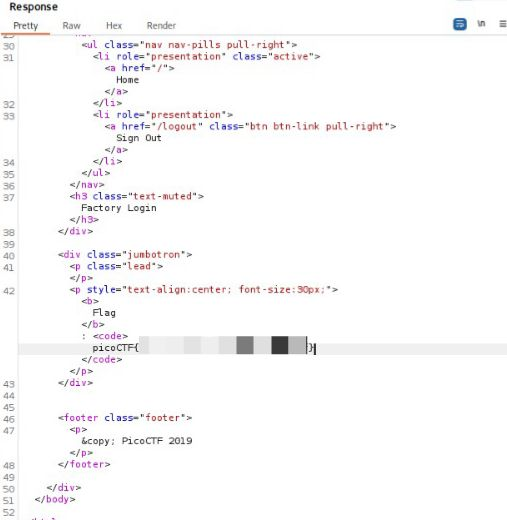

## logon - Web Exploitation - Easy
#### Author: bobson

Dicas:
1. Hmm it doesn't seem to check anyone's password, except for Joe's?

Ao abrir a página, tentei logar com "Joe" e uma senha aleatória. Observei a requisição de POST para /login no Burp Suite (**Proxy > HTTP History**). A requisição possuía uma parte específica que chamava a atenção: "`Cookie: password=; username=; admin=False`". Ademais, também havia um parágrafo de resposta que aontava o caminho "`/flag`". Todos serão úteis para uma escalada de privilégios pelos cookies.  
Assim, alterando a requisição de POST para `GET`, o caminho /login para `/flag` e a autorização de administrador do cookie para `admin=True`, obtemos uma resposta válida do servidor, que contém a flag!

  

